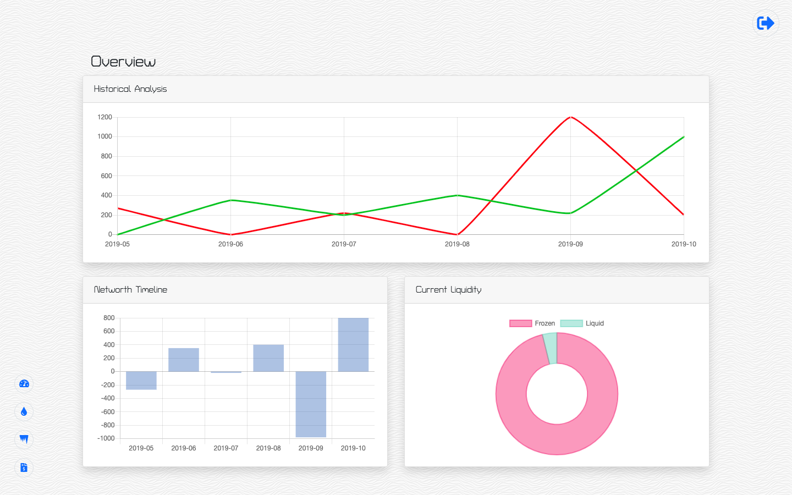
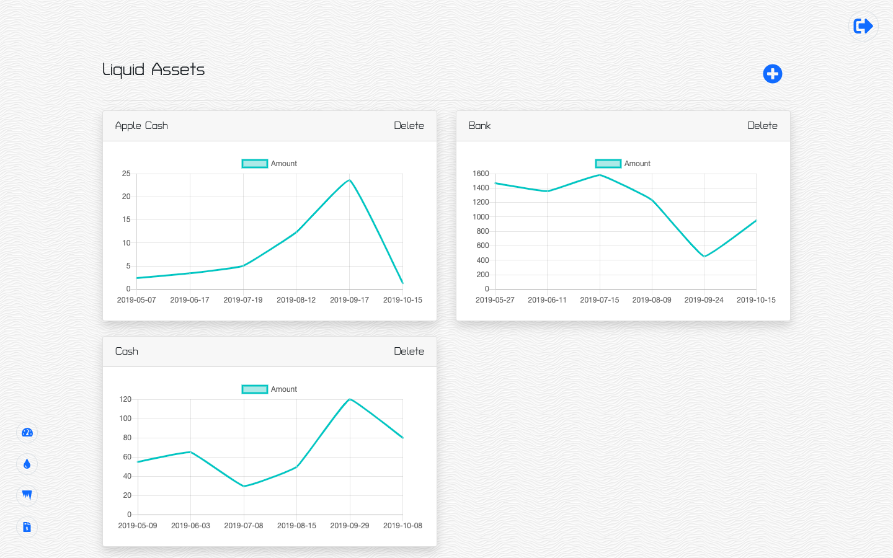
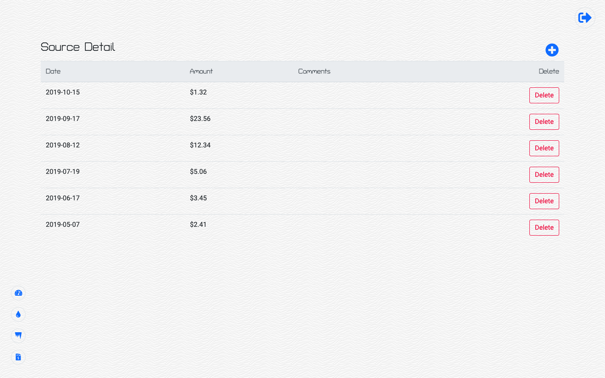
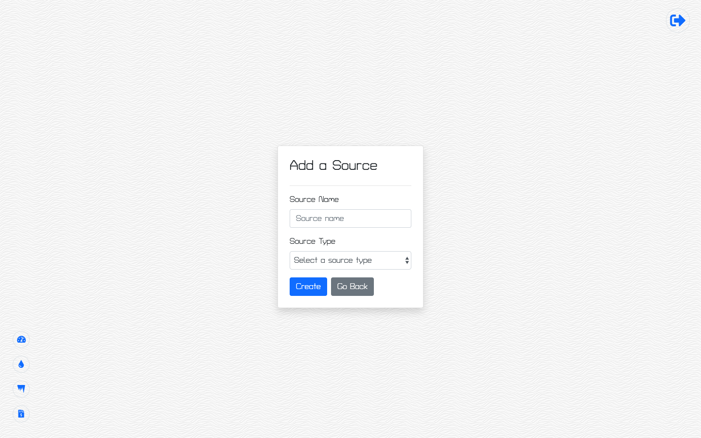
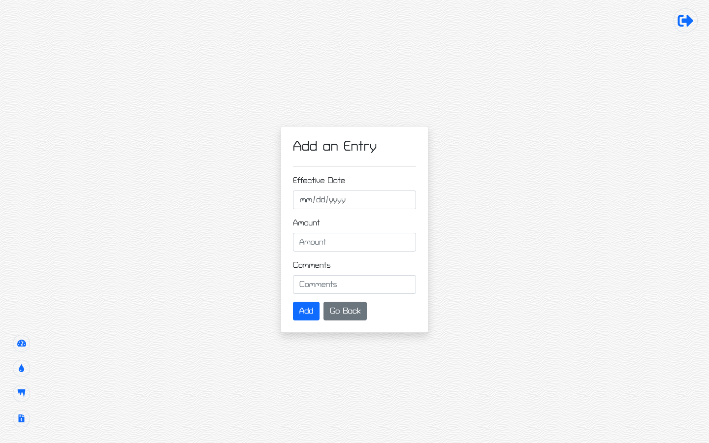

# **Networthy**

## Credits

©2019 Matthew Farmer, JiSoo Noh, Wendy Chen, and Zuoyi Phang

## Application Link

http://networthy.herokuapp.com/

## About

Networthy is a personal financial management application that Users can add and remove certain sources of assets. Within the sources, Users can add entries. Networthy gives you a complete look into your finances, from bank accounts and credit cards to student loans and 401k. Everything is shown in simple, intuitive graphs and tables to give a user-friendly approach to the applicaton.

## Walkthrough

### Login

Upon accessing the application, users are prompted for their Google login credentials without having to sign up.

### Overview

After logging in, users are directed to the Overview page which displays their Historical Analysis, Networth Timeline, and their Current Liquidity. These are compiled from the data entered within the Liquid, Frozen, and Liabiities Assets. At the bottom-left of the page, the user will find the application-wide navigation buttons.

### Liquid Assets, Frozen Assets, and Liabilities

The graphs are displaying data changes within each asset which are dynamically shown after each entry.

### Source Details

This will display the collective data entered by the user which will include the date, amount, and comment of their entries. Users can add more entries within the sources that are created and also delete any entries that they do not want.

### Adding Sources

Sources can be added by entering into any assets page then clicking the blue plus button on the right side which will prompt a modal to pop up. Within that modal, Users can add a Source Name and a Source Location where they would like that source to be added to. After submitting, this will prompt the User back to the page they were previously at and display any changes if it applied to that page. Sources can also be deleted upon the users liking.

### Adding Entries

Entries can be added by entering into the desired assets page then clicking the source which will prompt the User to the Source Detail page of that source. Users then can click on the blue plus icon on the right to begin adding a new entry. Users will then be prompted with a modal that asks the Effective date of the entry they want to enter, Amount they are entering, and any comments they would like with that entry. After submitting, this will prompt the User back to the page they were previously at and display any changes if it applied to that page. Entried can also be deleted within the Source Detail page under each Source.

## Technologies Used

This application is built on NodeJS and hosted via Heroku. The following is a list of utilized technologies:

- Animate.css
- Bootstrap
- ChartsJS
- Express
- Firebase Authentication
- ReactJS
- Heroku
- Moment (package)
- MySQL (via JawsDB)
- NodeJS
- Sequelize
- UUID (package)
